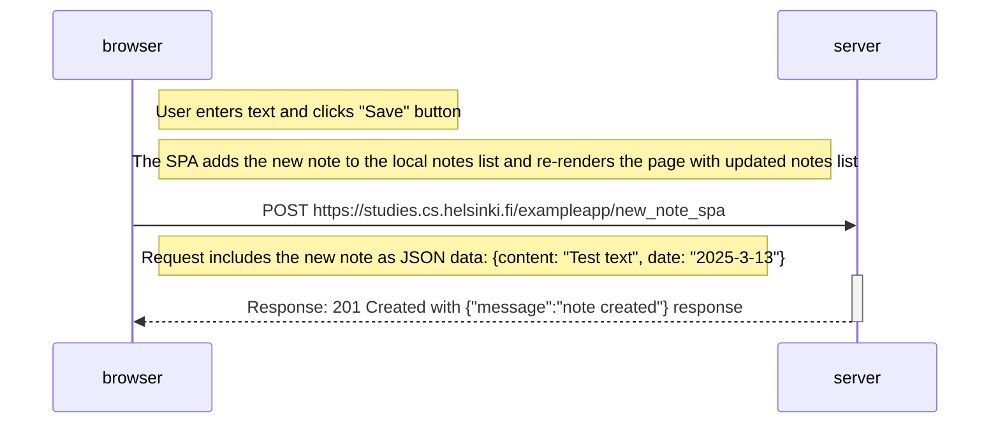

```mermaid
sequenceDiagram
    participant browser
    participant server

    Note right of browser: User enters text and clicks "Save" button
    
    Note right of browser: The SPA adds the new note to the local notes list and re-renders the page with updated notes list
    
    browser->>server: POST https://studies.cs.helsinki.fi/exampleapp/new_note_spa
    Note right of browser: Request includes the new note as JSON data: {content: "Test text", date: "2025-3-13"}
    activate server
    server-->>browser: Response: 201 Created with {"message":"note created"} response
    deactivate server
```